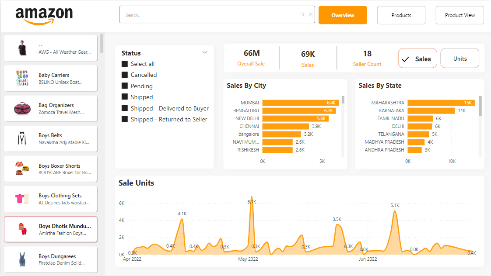
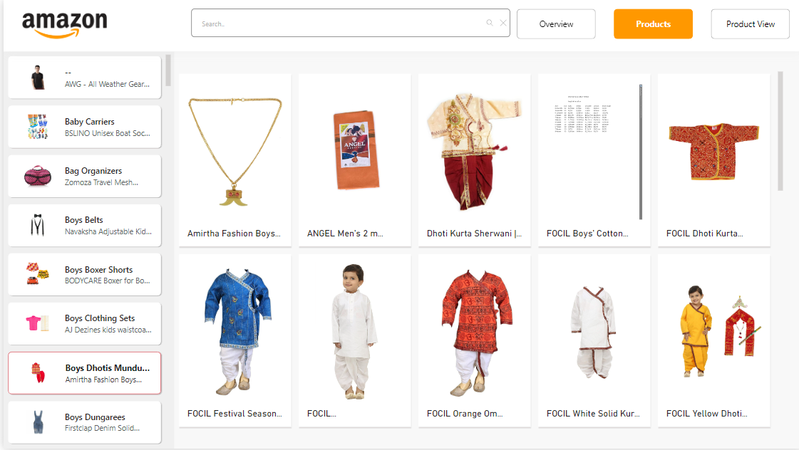
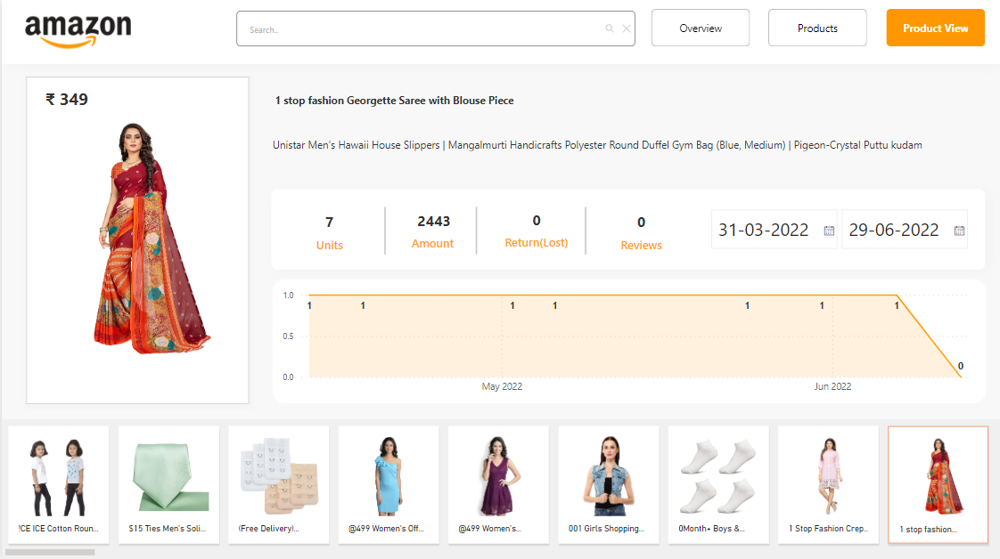

# Amazon Sales Dashboard

## Dashboard Overview

The Amazon Sales Dashboard provides insights into the e-commerce site's sales performance. It consists of three main pages: Overview, Products, and Product View.

## Access Dashboard

Access the Amazon Sales Dashboard [here](https://app.powerbi.com/view?r=eyJrIjoiYTM0ODIwYmItZDBlYi00MDBiLTg0MjctZDUxZjA3MzgyZjdlIiwidCI6ImM2ZTU0OWIzLTVmNDUtNDAzMi1hYWU5LWQ0MjQ0ZGM1YjJjNCJ9&pageName=ReportSection837ef69ea3c5e678386e).

## Screenshots

### Overview Page

- Filters: Payment Status, Product Category
- KPIs: Overall Sales, Sales Count, Seller Count
- Sales by City
- Sales Units

### Products Page

- Product Category Slicer
- List of All Products

### Product View Page

- Products with Sales Amount and Sales Quantity

## About Power BI

Power BI is a business analytics tool by Microsoft that enables users to visualize and analyze data from various sources. It provides interactive dashboards and reports, empowering users to gain insights and make data-driven decisions.

## Power BI Documentation

For more information about Power BI and its features, refer to the [official documentation](https://docs.microsoft.com/en-us/power-bi/).

## Contact

If you have any queries or bugs to report, feel free to reach out to me on [LinkedIn](https://www.linkedin.com/in/pratheekpshenoy/).

